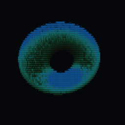

<!-- <CENTERED SECTION FOR GITHUB DISPLAY> -->

<div align="center">

[](https://tokscale.ai)

</div>

> A high-performance CLI tool and visualization dashboard for tracking token usage and costs across multiple AI coding agents.

> [!TIP]
>
> v2 is here — native Rust TUI, cross-platform support, and more. <br />
> I drop new open-source work every week. Don't miss the next one.
>
> | [](https://github.com/junhoyeo) | Follow [@junhoyeo](https://github.com/junhoyeo) on GitHub for more projects. Hacking on AI, infra, and everything in between. |
> | :-----| :----- |
> [](https://discord.gg/h6DUGWdBbm) | Come hang out in our [Discord](https://discord.gg/h6DUGWdBbm) — and surround yourself with the world's top-tier vibers. |

<div align="center">

[](https://github.com/junhoyeo/tokscale/releases)
[](https://www.npmjs.com/package/tokscale)
[](https://www.npmjs.com/package/tokscale)
[](https://github.com/junhoyeo/tokscale/graphs/contributors)
[](https://github.com/junhoyeo/tokscale/network/members)
[](https://github.com/junhoyeo/tokscale/stargazers)
[](https://github.com/junhoyeo/tokscale/issues)
[](https://github.com/junhoyeo/tokscale/blob/master/LICENSE)
[](https://github.com/junhoyeo/tokscale/issues/403)

[🇺🇸 English](README.md) | [🇰🇷 한국어](README.ko.md) | [🇯🇵 日本語](README.ja.md) | [🇨🇳 简体中文](README.zh-cn.md)

</div>

<!-- </CENTERED SECTION FOR GITHUB DISPLAY> -->

| Overview | Models |
|:---:|:---:|
|  |  | 

| Daily Summary | Stats |
|:---:|:---:|
|  |  | 

| Frontend (3D Contributions Graph) | Wrapped 2025 |
|:---:|:---:|
| <a href="https://tokscale.ai"></a> | <a href="#wrapped-2025"></a> |

> **Run [`bunx tokscale@latest submit`](#social) to submit your usage data to the leaderboard and create your public profile!**

## Overview

**Tokscale** helps you monitor and analyze your token consumption from:

| Logo | Client | Data Location | Supported |
|------|----------|---------------|-----------|
|  | [OpenCode](https://github.com/sst/opencode) | `~/.local/share/opencode/opencode.db` (1.2+, all channels including `opencode-stable.db`) or/and `~/.local/share/opencode/storage/message/` (legacy/unmigrated) | ✅ Yes |
|  | [Claude Code](https://docs.anthropic.com/en/docs/claude-code) | `~/.claude/projects/` and `~/.claude/transcripts/` | ✅ Yes |
|  | [OpenClaw](https://openclaw.ai/) | `~/.openclaw/agents/` (+ legacy: `.clawdbot`, `.moltbot`, `.moldbot`) | ✅ Yes |
|  | [Codex CLI](https://github.com/openai/codex) | `~/.codex/sessions/` | ✅ Yes |
|  | [Sakana Fugu](https://sakana.ai/fugu/) | via Codex — `~/.codex/sessions/*.jsonl` (`model_provider: sakana`) | ✅ Yes |
|  | [GitHub Copilot CLI](https://docs.github.com/en/copilot/how-tos/use-copilot-agents/use-the-github-copilot-coding-agent-in-cli) | `~/.copilot/otel/*.jsonl` (+ `COPILOT_OTEL_FILE_EXPORTER_PATH`) | ✅ Yes |
|  | [Hermes Agent](https://github.com/NousResearch/hermes-agent) | `$HERMES_HOME/state.db` (fallback: `~/.hermes/state.db`) | ✅ Yes |
|  | [Gemini CLI](https://github.com/google-gemini/gemini-cli) | `$GEMINI_CLI_HOME/tmp/*/chats/*.json` (fallback: `~/.gemini/tmp/*/chats/*.json`) | ✅ Yes |
|  | [Cursor IDE](https://cursor.com/) | Cursor API export cached at `~/.config/tokscale/cursor-cache/usage*.csv` (not `~/.cursor`) | ✅ Yes |
|  | [Amp (AmpCode)](https://ampcode.com/) | `~/.local/share/amp/threads/` | ✅ Yes |
|  | [Codebuff](https://codebuff.com/) | `~/.config/manicode/` (+ `manicode-dev`, `manicode-staging`; override via `CODEBUFF_DATA_DIR`) | ✅ Yes |
|  | [Droid (Factory Droid)](https://factory.ai/) | `~/.factory/sessions/` | ✅ Yes |
|  | [Pi](https://github.com/badlogic/pi-mono) | `~/.pi/agent/sessions/` and `~/.omp/agent/sessions/` ([Oh My Pi](https://github.com/can1357/oh-my-pi)) | ✅ Yes |
|  | [Kimi CLI](https://github.com/MoonshotAI/kimi-cli) / [Kimi Code](https://github.com/MoonshotAI/kimi-code) | kimi-cli: `~/.kimi/sessions/` kimi-code: `~/.kimi-code/sessions/` (override via `KIMI_CODE_HOME`) | ✅ Yes |
|  | [Qwen CLI](https://github.com/QwenLM/qwen-cli) | `~/.qwen/projects/` | ✅ Yes |
|  | [Roo Code](https://github.com/RooCodeInc/Roo-Code) | `~/.config/Code/User/globalStorage/rooveterinaryinc.roo-cline/tasks/` (+ server: `~/.vscode-server/data/User/globalStorage/rooveterinaryinc.roo-cline/tasks/`) | ✅ Yes |
|  | [Kilo](https://github.com/Kilo-Org/kilocode) | `~/.config/Code/User/globalStorage/kilocode.kilo-code/tasks/` (+ server: `~/.vscode-server/data/User/globalStorage/kilocode.kilo-code/tasks/`) | ✅ Yes |
|  | [Kilo CLI](https://github.com/nicepkg/kilo) | `~/.local/share/kilo/kilo.db` | ✅ Yes |
|  | [Mux](https://github.com/coder/mux) | `~/.mux/sessions/` | ✅ Yes |
|  | [Crush](https://crush.ai/) | `$XDG_DATA_HOME/crush/projects.json` (project registry; fallback: `~/.local/share/crush/projects.json`) | ✅ Yes |
|  | [Goose](https://github.com/aaif-goose/goose) | `~/.local/share/goose/sessions/sessions.db` (+ macOS Application Support, legacy Block/goose paths; override via `GOOSE_PATH_ROOT`) | ✅ Yes |
|  | [Google Antigravity](https://antigravity.google/) | Cached via `tokscale antigravity sync` to `~/.config/tokscale/antigravity-cache/sessions/*.jsonl` (live RPC against the local language server) | ✅ Yes |
|  | [Antigravity CLI](https://antigravity.google/) | `~/.gemini/antigravity-cli/conversations/*.db` (override the Gemini home via `GEMINI_CLI_HOME`; local SQLite, read directly — no `antigravity sync` needed) | ✅ Yes |
|  | [Trae IDE](https://www.trae.ai/) / [Trae Solo](https://www.trae.ai/solo) (international) | Cached via `tokscale trae sync` to `~/.config/tokscale/trae-cache/sessions/*.json` (account-level usage from the official API) | ✅ Yes |
|  | [Warp](https://www.warp.dev/) / Oz | Cached via `tokscale warp sync` to `~/.config/tokscale/warp-cache/usage.json` (aggregate requests and spend only; no token transcripts) | ✅ Yes |
|  | Grok Build | `$GROK_HOME/sessions/*/*/updates.jsonl` (fallback: `~/.grok/sessions/*/*/updates.jsonl`) | ✅ Yes |
|  | [Zed Agent](https://zed.dev/docs/ai/agent-panel) | `~/.local/share/zed/threads/threads.db` (macOS: `~/Library/Application Support/Zed/threads/threads.db`; Windows: `%LOCALAPPDATA%/Zed/threads/threads.db`; hosted Zed models only, not external ACP agents) | ✅ Yes |
|  | Kiro | `~/.kiro/sessions/cli/*.json` (+ `*.jsonl`), `~/.local/share/kiro-cli/data.sqlite3` (macOS: `~/Library/Application Support/kiro-cli/data.sqlite3`), and Kiro IDE globalStorage snapshots (`Kiro/User/globalStorage/kiro.kiroagent`; macOS Application Support, Linux `~/.config/Kiro`, Windows `%APPDATA%\Kiro`) | ✅ Yes |
|  | [Cline](https://github.com/cline/cline) | VS Code globalStorage tasks (Linux: `~/.config/Code/...`; macOS: `~/Library/Application Support/Code/...`; Windows: `%APPDATA%\Code\...`; server: `~/.vscode-server/data/User/globalStorage/saoudrizwan.claude-dev/tasks/`) | ✅ Yes |
|  | [gajae-code (gjc)](https://github.com/Yeachan-Heo/gajae-code) | `~/.gjc/agent/sessions/` (override via `GJC_CODING_AGENT_DIR`, `GJC_CONFIG_DIR`, `PI_CONFIG_DIR`; `$XDG_DATA_HOME/gjc/sessions/` on Linux/macOS) | ✅ Yes |
|  | [Jcode](https://github.com/1jehuang/jcode) | `~/.jcode/sessions/session_*.json` + `session_*.journal.jsonl` sidecars (override via `JCODE_HOME`) | ✅ Yes |
|  | [MiMo Code](https://github.com/XiaomiMiMo/MiMo-Code) | `~/.local/share/mimocode/mimocode.db` (XDG data dir; SQLite) | ✅ Yes |
|  | [Junie](https://www.jetbrains.com/junie/) | `~/.junie/sessions/*/events.jsonl` | ✅ Yes |
|  | [Command Code](https://github.com/CommandCodeAI/command-code) | `~/.commandcode/projects/**/*.jsonl` (token usage estimated from transcripts at ~4 chars/token; not persisted on disk) | ✅ Yes |
|  | [ZCode](https://zcode.z.ai/) | `~/.zcode/cli/db/db.sqlite` (v2 usage database) and `~/.zcode/projects/**/*.jsonl` (legacy transcripts) | ✅ Yes |
|  | [OpenCodeReview](https://github.com/alibaba/open-code-review) | `~/.opencodereview/sessions/**/*.jsonl` | ✅ Yes |
|  | [CodeBuddy CLI](https://www.codebuddy.cn/docs/cli/overview) | `~/.codebuddy/projects/**/*.jsonl` | ✅ Yes |
|  | WorkBuddy | `~/.workbuddy/workbuddy.db` (aggregate session usage) | ✅ Yes |
|  | [Synthetic](https://synthetic.new/) | Re-attributed from other sources via `hf:` model prefix or `synthetic` provider (+ [Octofriend](https://github.com/synthetic-lab/octofriend): `~/.local/share/octofriend/sqlite.db`) | ✅ Yes |

Get real-time pricing calculations using [🚅 LiteLLM's pricing data](https://github.com/BerriAI/litellm), with support for tiered pricing models and cache token discounts.

### Why "Tokscale"?

[](https://tokscale.ai)

This project is inspired by the **[Kardashev scale](https://en.wikipedia.org/wiki/Kardashev_scale)**, a method proposed by astrophysicist Nikolai Kardashev to measure a civilization's level of technological advancement based on its energy consumption. A Type I civilization harnesses all energy available on its planet, Type II captures the entire output of its star, and Type III commands the energy of an entire galaxy.

In the age of AI-assisted development, **tokens are the new energy**. They power our reasoning, fuel our productivity, and drive our creative output. Just as the Kardashev scale tracks energy consumption at cosmic scales, Tokscale measures your token consumption as you scale the ranks of AI-augmented development. Whether you're a casual user or burning through millions of tokens daily, Tokscale helps you visualize your journey up the scale—from planetary developer to galactic code architect.

## Contents

- [Overview](#overview)
  - [Why "Tokscale"?](#why-tokscale)
- [Features](#features)
- [Installation](#installation)
  - [Quick Start](#quick-start)
  - [Prerequisites](#prerequisites)
  - [Development Setup](#development-setup)
  - [Building the Native Module](#building-the-native-module)
- [Usage](#usage)
  - [Basic Commands](#basic-commands)
  - [TUI Features](#tui-features)
  - [Filtering by Platform](#filtering-by-platform)
  - [Date Filtering](#date-filtering)
  - [Pricing Lookup](#pricing-lookup)
  - [Social](#social)
  - [Cursor IDE Commands](#cursor-ide-commands)
  - [Antigravity Commands](#antigravity-commands)
  - [Trae Commands](#trae-commands)
  - [Warp/Oz Commands](#warpoz-commands)
  - [Task-Attributed Report](#task-attributed-report)
  - [Subscription Usage](#subscription-usage)
  - [Example Output](#example-output---light-version)
  - [Configuration](#configuration)
  - [Environment Variables](#environment-variables)
- [Frontend Visualization](#frontend-visualization)
  - [Features](#features-1)
  - [Running the Frontend](#running-the-frontend)
- [Social Platform](#social-platform)
  - [Features](#features-2)
  - [Getting Started](#getting-started)
  - [Data Validation](#data-validation)
- [Wrapped 2025](#wrapped-2025)
  - [Command](#command)
  - [What's Included](#whats-included)
- [Development](#development)
  - [Prerequisites](#prerequisites-1)
  - [How to Run](#how-to-run)
- [Supported Platforms](#supported-platforms)
  - [Native Module Targets](#native-module-targets)
  - [Windows Support](#windows-support)
- [Session Data Retention](#session-data-retention)
- [Data Sources](#data-sources)
- [Pricing](#pricing)
- [Contributing](#contributing)
  - [Development Guidelines](#development-guidelines)
- [Acknowledgments](#acknowledgments)
- [License](#license)

## Features

- **Interactive TUI Mode** - Beautiful terminal UI powered by Ratatui (default mode)
  - 6 interactive views: Overview, Models, Daily, Hourly, Stats, Agents (plus an optional Minutely view, opt-in via `minutelyTabEnabled`)
  - Keyboard & mouse navigation
  - GitHub-style contribution graph with 9 color themes
  - Real-time filtering and sorting
  - Zero flicker rendering
- **Multi-platform support** - Track usage across OpenCode, Claude Code, Codex CLI, Copilot CLI, Cursor IDE, Gemini CLI, Amp, Codebuff, Droid, OpenClaw, Hermes Agent, Pi, Kimi CLI, Qwen CLI, Roo Code, Kilo, Mux, Kilo CLI, Crush, Goose, Antigravity, Antigravity CLI, Zed, Kiro, Trae, Warp/Oz, Cline, Gajae-Code, Grok Build, Jcode, MiMo Code, Command Code, Junie, ZCode, OpenCodeReview, CodeBuddy, and Synthetic
- **Multi-platform support** - Track usage across OpenCode, Claude Code, Codex CLI, Copilot CLI, Cursor IDE, Gemini CLI, Amp, Codebuff, Droid, OpenClaw, Hermes Agent, Pi, Kimi CLI, Qwen CLI, Roo Code, Kilo, Mux, Kilo CLI, Crush, Goose, Antigravity, Antigravity CLI, Zed, Kiro, Trae, Warp/Oz, Cline, Gajae-Code, Grok Build, Jcode, MiMo Code, Command Code, Junie, ZCode, OpenCodeReview, WorkBuddy, and Synthetic
- **Real-time pricing** - Fetches current pricing from LiteLLM with 1-hour disk cache; automatic OpenRouter fallback and Cursor model pricing for newly released models
- **Detailed breakdowns** - Input, output, cache read/write, and reasoning token tracking
- **Native Rust core** - All parsing and aggregation done in Rust for 10x faster processing
- **Web visualization** - Interactive contribution graph with 2D and 3D views
- **Flexible filtering** - Filter by platform, date range, or year
- **Task-attributed reports** - LLM-powered session summarization and task grouping with multi-backend support (Apple FM, Claude, Codex, Gemini, Kiro)
- **Export to JSON** - Generate data for external visualization tools
- **Social Platform** - Share your usage, compete on leaderboards, and view public profiles

## Installation

### Quick Start

```bash
# Run directly with npx
npx tokscale@latest

# Or use bunx
bunx tokscale@latest

# Or use Deno without installing an alias
deno x npm:tokscale@latest

# Light mode (table rendering only)
npx tokscale@latest --light
```

That's it! This gives you the full interactive TUI experience with zero setup.

> **Package Structure**: `tokscale` is an alias package (like [`swc`](https://www.npmjs.com/package/swc)) that installs `@tokscale/cli`. Both install the same CLI with the native Rust core (`@tokscale/core`) included.


### Prerequisites

- [Node.js](https://nodejs.org/) or [Bun](https://bun.sh/)
- (Optional) Rust toolchain for building native module from source

### Development Setup

For local development or building from source:

```bash
# Clone the repository
git clone https://github.com/junhoyeo/tokscale.git
cd tokscale

# Install Bun (if not already installed)
curl -fsSL https://bun.sh/install | bash

# Install dependencies
bun install

# Run the CLI in development mode
bun run cli
```

> **Note**: `bun run cli` is for local development. When installed via `bunx tokscale`, the command runs directly. The Usage section below shows the installed binary commands.

### Building the Native Module

The native Rust module is **required** for CLI operation. It provides ~10x faster processing through parallel file scanning and SIMD JSON parsing:

```bash
# Build the native core (run from repository root)
bun run build:core
```

> **Note**: Native binaries are pre-built and included when you install via `bunx tokscale@latest`. Building from source is only needed for local development.

## Usage

### Basic Commands

```bash
# Launch interactive TUI (default)
tokscale

# Launch TUI with specific tab
tokscale models    # Models tab
tokscale monthly   # Daily view (shows daily breakdown)
tokscale hourly    # Hourly tab

# Use legacy CLI table output
tokscale --light
tokscale models --light

# Launch TUI explicitly
tokscale tui

# Export contribution graph data as JSON
tokscale graph --output data.json

# Output data as JSON (for scripting/automation)
tokscale --json                    # Default models view as JSON
tokscale models --json             # Models breakdown as JSON
tokscale monthly --json            # Monthly breakdown as JSON
tokscale models --json > report.json   # Save to file
```

### TUI Features

The interactive TUI mode provides:

- **8 Views**: Overview (chart + top models), Usage (subscription quotas), Models, Daily, Hourly, Stats (contribution graph), Agents. A per-minute view (Minutely) is hidden by default and can be enabled with `minutelyTabEnabled` in `settings.json` — see [Configuration](#configuration)
- **Keyboard Navigation**:
  - `←/→/Tab/BackTab`: Switch views
  - `↑/↓` or `Home/End`: Navigate lists
  - `Enter`: Open daily detail (Daily tab) / select graph cell (Stats tab)
  - `Esc` or `Backspace`: Close dialog or exit detail view
  - `c/d/t`: Sort by cost/date/tokens
  - `j`: Jump to today
  - `s`: Open source picker dialog
  - `g`: Open group-by picker dialog (model, client+model, client+provider+model, workspace+model, session+model, client+session+model)
  - `h`: Toggle Daily/Hourly chart granularity (Overview tab)
  - `v`: Toggle Table/Profile view (Hourly tab)
  - `y`: Copy selected row to clipboard
  - `p`: Cycle through 9 color themes
  - `r`: Refresh data; `Shift+R` toggles auto-refresh; `+`/`-` adjusts interval
  - `e`: Export to JSON
  - `q` or `Ctrl+C`: Quit
- **Mouse Support**: Click tabs, buttons, and filters
- **Themes**: Green, Halloween, Teal, Blue, Pink, Purple, Orange, Monochrome, YlGnBu
- **Settings Persistence**: Preferences saved to `~/.config/tokscale/settings.json` (see [Configuration](#configuration))

### Group-By Strategies

Press `g` in the TUI or use `--group-by` in `--light`/`--json` mode to control how model rows are aggregated:

| Strategy | Flag | TUI Default | Effect |
|----------|------|-------------|--------|
| **Model** | `--group-by model` | ✅ | One row per model — merges all clients and providers |
| **Client + Model** | `--group-by client,model` | | One row per client-model pair |
| **Client + Provider + Model** | `--group-by client,provider,model` | | Most granular — no merging |
| **Workspace + Model** | `--group-by workspace,model` | | Group local usage by workspace key, then model |
| **Session + Model** | `--group-by session,model` | | One row per `session_id` and model — attribute cost to a specific agent-CLI session |
| **Client + Session + Model** | `--group-by client,session,model` | | One row per client, session, and model — useful for multi-agent runners that join on `session_id` |

**`--group-by model`** (most consolidated)

| Clients | Providers | Model | Cost |
|---------|-----------|-------|------|
| OpenCode, Claude, Amp | github-copilot, anthropic | claude-opus-4-5 | $2,424 |
| OpenCode, Claude | anthropic, github-copilot | claude-sonnet-4-5 | $1,332 |

**`--group-by client,model`** (CLI default)

| Client | Provider | Model | Cost |
|--------|----------|-------|------|
| OpenCode | github-copilot, anthropic | claude-opus-4-5 | $1,368 |
| Claude | anthropic | claude-opus-4-5 | $970 |

**`--group-by client,provider,model`** (most granular)

| Client | Provider | Model | Cost |
|--------|----------|-------|------|
| OpenCode | github-copilot | claude-opus-4-5 | $1,200 |
| OpenCode | anthropic | claude-opus-4-5 | $168 |
| Claude | anthropic | claude-opus-4-5 | $970 |

**`--group-by session,model`** (per-session cost attribution)

`tokscale models --json --group-by session,model` emits one entry per `(session_id, model)`. Each entry includes a top-level `sessionId` field so downstream tools (e.g. multi-agent IDEs) can join cost data back to a specific agent-CLI session:

```json
{
  "groupBy": "session,model",
  "entries": [
    {
      "sessionId": "019e1e27-af49-7cd1-89b7-7bad1c3f3be2",
      "client": "codex",
      "provider": "openai",
      "model": "gpt-5",
      "input": 25251,
      "output": 47,
      "cacheRead": 1920,
      "cacheWrite": 0,
      "reasoning": 40,
      "messageCount": 12,
      "cost": 0.0123
    }
  ]
}
```

Use `--group-by client,session,model` when you also need the client name on every row (one spawn across all 20+ supported CLIs at once).

### Filtering by Platform

Use `--client` (short `-c`) to scope reports to one or more clients. The flag is repeatable, accepts comma-separated values, and works with every report command:

```bash
# Show only OpenCode usage
tokscale --client opencode

# Comma-separated: combine multiple clients
tokscale --client opencode,claude

# Repeated: same effect, useful with shell aliases
tokscale -c opencode -c claude

# Cursor IDE uses Tokscale's API cache; run login + sync --json first
tokscale --client cursor

# Synthetic (synthetic.new) is detected from other agent sessions
tokscale --client synthetic

# Combine with other filters
tokscale --client opencode,claude --week --json
```

Possible values: `opencode`, `claude`, `codex`, `copilot`, `gemini`, `cursor`, `amp`, `codebuff`, `droid`, `openclaw`, `hermes`, `pi`, `kimi`, `qwen`, `roocode`, `kilocode`, `kilo`, `mux`, `crush`, `goose`, `antigravity`, `antigravity-cli`, `zed`, `kiro`, `trae`, `warp`, `cline`, `gjc`, `grok`, `jcode`, `micode`, `commandcode`, `junie`, `zcode`, `opencodereview`, `codebuddy`, `synthetic`.

> **Breaking change (v4.0.0):** The per-client boolean flags (`--opencode`, `--claude`, `--codex`, etc.) have been removed and now error. Use the canonical `--client`/`-c` flag instead — e.g. `tokscale --client opencode,claude`.

### Date Filtering

Date filters work across all commands that generate reports (`tokscale`, `tokscale models`, `tokscale monthly`, `tokscale graph`):

```bash
# Quick date shortcuts
tokscale --today              # Today only
tokscale --yesterday          # Yesterday only
tokscale --week               # Last 7 days
tokscale --month              # Current calendar month

# Custom date range (inclusive, local timezone)
tokscale --since 2024-01-01 --until 2024-12-31

# Filter by year
tokscale --year 2024

# Combine with other options
tokscale models --week --client claude --json
tokscale monthly --month --benchmark
```

> **Note**: Date filters use your local timezone. Both `--since` and `--until` are inclusive.
> **v2.2.0 note**: Session active-time daily buckets also use your local timezone, so users outside UTC may see active-time dates align with local token/cost report days instead of UTC day boundaries.

### Pricing Lookup

Look up real-time pricing for any model:

```bash
# Look up model pricing
tokscale pricing "claude-3-5-sonnet-20241022"
tokscale pricing "gpt-4o"
tokscale pricing "grok-code"

# Force specific provider source
tokscale pricing "grok-code" --provider openrouter
tokscale pricing "claude-3-5-sonnet" --provider litellm

# Inspect custom pricing overrides
tokscale pricing list-overrides
```

**Lookup Strategy:**

The pricing lookup uses a multi-step resolution strategy:

1. **Custom Pricing Overrides** - Exact user-defined entries from `~/.config/tokscale/custom-pricing.json`
2. **Exact Match** - Direct lookup in LiteLLM/OpenRouter databases
3. **Alias Resolution** - Resolves friendly names (e.g., `big-pickle` → `glm-4.7`)
4. **Tier Suffix Stripping** - Removes quality tiers (`gpt-5.2-xhigh` → `gpt-5.2`)
5. **Version Normalization** - Handles version formats (`claude-3-5-sonnet` ↔ `claude-3.5-sonnet`)
6. **Provider Prefix Matching** - Tries common prefixes (`anthropic/`, `openai/`, etc.)
7. **Cursor Model Pricing** - Hardcoded pricing for models not yet in LiteLLM/OpenRouter (e.g., `gpt-5.3-codex`)
8. **Fuzzy Matching** - Word-boundary matching for partial model names

### Custom Pricing Overrides

Create `custom-pricing.json` in Tokscale's config directory (`~/.config/tokscale/custom-pricing.json` on macOS/Linux by default; the same directory resolved by `TOKSCALE_CONFIG_DIR` when set) to override prices for model IDs that upstream pricing databases do not yet cover correctly.

```json
{
  "$schema": "https://tokscale.ai/custom-pricing.schema.json",
  "models": {
    "accounts/fireworks/routers/kimi-k2p6-turbo": {
      "input_cost_per_million_tokens": 2.00,
      "output_cost_per_million_tokens": 8.00,
      "cache_read_input_token_cost_per_million_tokens": 0.30,
      "source": "https://docs.fireworks.ai/serverless/pricing",
      "notes": "Fireworks Kimi K2.6 Turbo (preview)"
    },
    "accounts/fireworks/models/kimi-k2p6": {
      "input_cost_per_million_tokens": 0.95,
      "output_cost_per_million_tokens": 4.00,
      "cache_read_input_token_cost_per_million_tokens": 0.16
    },
    "kimi-k2p6-turbo": {
      "input_cost_per_million_tokens": 2.00,
      "output_cost_per_million_tokens": 8.00
    }
  }
}
```

Override prices are entered in dollars per million tokens, matching how most API providers publish pricing; Tokscale converts them to per-token rates internally. At least one of `input_cost_per_million_tokens` or `output_cost_per_million_tokens` must be present and positive, and cache-read/cache-creation fields are optional. LiteLLM-style per-token field names such as `input_cost_per_token`, `output_cost_per_token`, and `cache_read_input_token_cost` are also accepted for copy/paste compatibility, but the per-million names are the recommended user-facing form. To omit a tier or cache price, leave the field out; negative or non-finite values are treated as invalid and the whole model entry is skipped so typos do not silently alter accounting. Optional `source` and `notes` fields are ignored by Tokscale and can be used for your own bookkeeping.

Overrides are exact-only and case-insensitive. Tokscale checks the raw model ID first, then the existing synthetic `/models/` normalization, then falls through to LiteLLM, OpenRouter, Cursor pricing, and fuzzy matching if no override matches. Raw exact matches beat normalized exact matches, so `accounts/fireworks/routers/kimi-k2p6-turbo` can override one gateway-specific model while `kimi-k2p6-turbo` can cover normalized `/models/` paths. Overrides are loaded once at startup; restart the command after editing the file. This is the recommended local fix for wrong-model pricing bugs while waiting on upstream LiteLLM pricing updates.

**Provider Preference:**

When multiple matches exist, original model creators are preferred over resellers:

| Preferred (Original) | Deprioritized (Reseller) |
|---------------------|-------------------------|
| `xai/` (Grok) | `azure_ai/` |
| `anthropic/` (Claude) | `bedrock/` |
| `openai/` (GPT) | `vertex_ai/` |
| `google/` (Gemini) | `together_ai/` |
| `meta-llama/` | `fireworks_ai/` |

Example: `grok-code` matches `xai/grok-code-fast-1` ($0.20/$1.50) instead of `azure_ai/grok-code-fast-1` ($3.50/$17.50).

### Social

```bash
# Login to Tokscale (opens browser for GitHub auth)
tokscale login

# Save an existing Tokscale API token without browser auth
tokscale login --token tt_xxx

# Check who you're logged in as
tokscale whoami

# Display your saved API token as a QR code (useful for sharing to another device)
# Encodes {"token":"tt_xxx","username":"..."} — scan with any QR reader
tokscale qr

# Submit your usage data to the leaderboard
tokscale submit

# Submit in CI/headless environments without writing credentials
# Precedence: TOKSCALE_API_TOKEN env > saved credentials file (~/.config/tokscale/credentials.json).
# When the env var is set, the saved file is ignored for that invocation.
TOKSCALE_API_TOKEN=tt_xxx tokscale submit

# Revoke a token: visit Settings > API Tokens on the leaderboard site
# (https://tokscale.ai/settings) and click "Revoke" on the token row.
# Revocation takes effect immediately — subsequent requests with that
# token will get HTTP 401 "Invalid API token".

# Submit with filters
tokscale submit --client opencode,claude --since 2024-01-01

# Preview what would be submitted (dry run)
tokscale submit --dry-run

# Logout
tokscale logout
```


### Cursor IDE Commands

Cursor IDE support uses Cursor's web API export, cached by Tokscale at `~/.config/tokscale/cursor-cache/usage*.csv`. Tokscale does not parse local Cursor Agent CLI state under `~/.cursor`.

Setup:

1. Open https://www.cursor.com/settings in your browser and sign in.
2. Copy the `WorkosCursorSessionToken` cookie value:
   - Network tab: make any request to `cursor.com/api/*`, then copy the value after `WorkosCursorSessionToken=` from the `Cookie` request header.
   - Application tab: open Cookies -> `https://www.cursor.com`, then copy the `WorkosCursorSessionToken` value.
3. Run `tokscale cursor login --name work` and paste the token.
4. Run `tokscale cursor sync --json` to populate `~/.config/tokscale/cursor-cache/usage.csv`.
5. Run `tokscale --client cursor` or any report command.

Treat the session token like a password. It is stored locally in `~/.config/tokscale/cursor-credentials.json`.

```bash
# Login to Cursor (requires session token from browser)
# --name is optional; it just helps you identify accounts later
tokscale cursor login --name work

# Check Cursor authentication status and session validity
tokscale cursor status

# List saved Cursor accounts
tokscale cursor accounts

# Manually refresh cached Cursor usage
tokscale cursor sync --json

# Switch active account (controls which account syncs to cursor-cache/usage.csv)
tokscale cursor switch work

# Logout from a specific account (keeps history; excludes it from aggregation)
tokscale cursor logout --name work

# Logout and delete cached usage for that account
tokscale cursor logout --name work --purge-cache

# Logout from all Cursor accounts (keeps history; excludes from aggregation)
tokscale cursor logout --all

# Logout from all accounts and delete cached usage
tokscale cursor logout --all --purge-cache
```

By default, Tokscale aggregates usage across all saved Cursor accounts by reading `cursor-cache/usage*.csv`. The active account syncs to `usage.csv`; additional accounts sync to `usage.<account>.csv`.

When you log out, Tokscale moves cached usage to `cursor-cache/archive/` so it is no longer aggregated. Use `--purge-cache` to delete cached usage instead.

### Antigravity Commands

Antigravity sync currently works on macOS and Linux only. The Antigravity-enabled editor must be running and its local language server available; tokscale reads usage from that local language server and caches normalized artifacts locally.

```bash
# Check whether tokscale can see running Antigravity language servers
tokscale antigravity status

# Sync usage from local Antigravity language servers into tokscale's cache
tokscale antigravity sync

# Delete the cached Antigravity artifacts
tokscale antigravity purge-cache
```

**Cache location**: `~/.config/tokscale/antigravity-cache/`

**How it works**: `tokscale antigravity sync` discovers local Antigravity session candidates, fetches confirmed usage data from the local language server RPC, and stores normalized JSONL artifacts for tokscale-core to parse later. Run sync before reports if you want the freshest Antigravity data.

### Trae Commands

Trae ([ByteDance's AI IDE](https://www.trae.ai/)) ships in two international product lines — Trae IDE and Trae Solo. They share the same account-level usage data (same backend, same JWT), so tokscale reports them as a single `trae` client. You can install either or both desktop apps; tokscale auto-discovers credentials from whichever is present.

Credentials are identified per desktop app via `--variant`:

- **`--variant ide`** — credentials from Trae IDE (`~/Library/Application Support/Trae/`)
- **`--variant solo`** — credentials from Trae Solo (`~/Library/Application Support/TRAE SOLO/`)

`tokscale trae sync` calls the official `query_user_usage_group_by_session` API exactly once per run (regardless of how many desktop apps are installed) and persists the raw JSON to a local cache.

```bash
# Log in (auto-detects credentials from any installed Trae desktop client)
tokscale trae login

# Manual JWT entry (for environments where auto-detect can't find storage.json,
# e.g. Linux/Windows or a headless server). Open https://www.trae.ai/account-setting#usage
# in your browser, then F12 → Network → filter `query_user_usage` and copy the
# `Authorization` header value.
tokscale trae login --manual --variant solo

# Show which variants have cached credentials
tokscale trae status

# Sync usage (uses the first available credential source)
tokscale trae sync --since 30

# Forget cached credentials for one variant
tokscale trae logout --variant solo
```

**Cache location**: `~/.config/tokscale/trae-cache/`

**How it works**: tokscale either decrypts the desktop client's `iCubeAuthInfo://*` blob (`globalStorage/storage.json`) to recover a JWT, or accepts one pasted via `--manual`. It then calls `POST /trae/api/v1/pay/query_user_usage_group_by_session` paginated and stores the raw JSON. Run sync before reports if you want the freshest Trae data.

> **Note on pricing**: Trae cost figures are **vendor-reported** — tokscale surfaces the `dollar_float` value returned by Trae's own API rather than recomputing cost from token counts through tokscale's pricing engine. Numbers will match what you see on `trae.ai/account-setting#usage`, not what tokscale would otherwise calculate for the same usage.

> **China variants**: The China editions (`trae.com.cn`) are intentionally **not** supported. The CN backend does not expose a session-level usage query API. Trae CN / Trae Solo CN support will be added once an official endpoint becomes available upstream.

### Warp/Oz Commands

Warp/Oz does not expose local token transcripts. Tokscale only syncs the aggregate request and spend counters returned by Warp's GraphQL API, then reports them as `warp` / `aggregate-requests` rows with zero token buckets.

```bash
# Save a bearer token or Cookie header copied from an authenticated Warp request
tokscale warp login

# Inspect credential/cache state and diagnostics
tokscale warp status

# Sync aggregate requests and spend into tokscale's local cache
tokscale warp sync

# Remove saved credentials; add --purge-cache to delete synced usage too
tokscale warp logout --purge-cache
```

**Cache location**: `~/.config/tokscale/warp-cache/usage.json`

**How it works**: `tokscale warp sync` calls Warp's authenticated GraphQL API for account and workspace aggregate counters. Tokscale preserves request counts as message counts and vendor-reported spend as cost, but it never converts requests into synthetic tokens. Warp is excluded from default `submit` data because the public leaderboard accepts token-attributed usage, not aggregate request counters.

### Task-Attributed Report

The `report` command generates a task-attributed usage breakdown. It uses an LLM to summarize each session into a short title and category, then groups related sessions into high-level task clusters for a bird's-eye view of where your tokens went.

```bash
# Basic report (today, default Apple FM summarizer)
tokscale report

# Last 7 days
tokscale report --week

# Use Claude Code as the summarizer backend
tokscale report --week --summarizer claude

# Use Codex, Gemini, or Kiro
tokscale report --summarizer codex
tokscale report --summarizer gemini
tokscale report --summarizer kiro

# Skip LLM summarization (show raw data only)
tokscale report --no-summarize

# Re-summarize from scratch (resets cached summaries in range)
tokscale report --week --rebuild

# Output as JSON
tokscale report --week --json

# Filter by workspace or client
tokscale report --workspace my-project --client opencode
```

**Summarizer backends:**

| Backend | Command | Notes |
|---------|---------|-------|
| `apple-fm` | (default) | On-device Apple Foundation Models via native Rust FFI (no Python). Enabled in the prebuilt Apple Silicon (macOS arm64) binary; runs on macOS 26+ with Apple Intelligence on, and transparently falls back to a built-in Rust heuristic everywhere else (Intel Macs, older macOS, Linux, Windows) — so the default works on every platform. |
| `claude` | `claude -p` | Requires Claude Code CLI installed and authenticated. |
| `codex` | `codex --quiet` | Requires Codex CLI installed and authenticated. |
| `gemini` | `gemini -p` | Requires Gemini CLI installed and authenticated. |
| `kiro` | `kiro --non-interactive` | Requires Kiro CLI installed and authenticated. |

**How it works:**

1. Sessions are scanned and inserted into a local SQLite wiki database (`wiki.db` in your platform config dir — e.g. `~/.config/tokscale/` on Linux, `~/Library/Application Support/tokscale/` on macOS)
2. Unsummarized sessions are sent to the chosen LLM backend in batches, which returns a title, category, description, and complexity for each
3. A second LLM pass groups all titled sessions into 3–8 high-level task clusters (e.g. "Kiro Auth", "Tokscale Report", "System Config")
4. Results are cached in the wiki DB — subsequent runs skip already-summarized sessions

**Example output:**

```
  Task Group                                  Sess     Tokens     Cost
  ───────────────────────────────────────────────────────────────────────
  Tokscale Development                          19      4.2B    $22.66
    Add task-attributed report command
    Implement wiki DB schema
    Fix pricing lookup for new models
  System Config                                 28      2.1B    $10.06
    Configure OpenCode workspace settings
    Update shell aliases
  Kiro Auth                                      4    890.5M     $3.10
    Implement JWT refresh flow
```

### Subscription Usage

Tokscale can fetch and display your real-time subscription quota across AI providers. This shows how much of your plan you've used and when limits reset.

```bash
# Show subscription usage for all detected providers
tokscale usage

# Output as JSON (for scripting)
tokscale usage --json

# Lightweight terminal output (no TUI)
tokscale usage --light
```

In the TUI, navigate to the **Usage** tab to see subscription data. Use `[Refresh]` to refresh subscription quotas. The keyboard refresh shortcut `r` uses the same refresh path.

> **Note**: Subscription quotas and balances are **vendor-reported** — tokscale calls each provider's own quota endpoint and surfaces the response verbatim. Numbers reflect what the provider reports (which is also what shows up in their official dashboards) and are not independently verified against tokscale's own usage tracking.

#### Supported Providers

| Provider | Auth Method | Metrics | Setup |
|----------|-------------|---------|-------|
| **Claude** | OAuth (credentials file or macOS Keychain) | Session (5hr), Weekly, Opus quotas | Run `claude` to log in |
| **Codex** (OpenAI) | OAuth (`~/.config/codex/auth.json`, `~/.codex/auth.json`, or saved Tokscale accounts) | Session, Weekly quotas | Use `[Add Codex]` in the TUI Usage tab, run `codex` to log in, or import an existing auth with `tokscale codex import --name work` |
| **Z.ai** | API key (env var) | Token limits, Web Searches | Set `ZAI_API_KEY` or `GLM_API_KEY` |
| **Amp** | API key (`~/.local/share/amp/secrets.json`) | Free tier balance, Credits | Run `amp` to log in |
| **GitHub Copilot** | GitHub token (keychain or `~/.config/gh/hosts.yml`) | Premium interactions, Chat quotas | Run `gh auth login` |
| **Grok Build** | OAuth (`~/.grok/auth.json`) | Credits, subscription plan | Run `grok login` |
| **Kimi** | OAuth (`~/.kimi/credentials/kimi-code.json`) | Session, Weekly quotas | Run `kimi` to log in |
| **MiniMax** | API key (env var) | Prompt quotas per model | Set `MINIMAX_API_KEY` or `MINIMAX_API_TOKEN` |
| **MiniMax Token Plan** | API key (env var) | Interval + weekly remaining-percent quotas (per region: CN minimaxi.com + Global minimax.io) | Set `MINIMAX_TOKEN_PLAN_CN_KEY` and/or `MINIMAX_TOKEN_PLAN_GLOBAL_KEY` |
| **Sakana** (Fugu) | Session cookie (env var or file) — billing-console HTML scrape, no public API | 5-hour, Weekly quota windows (plan tier + monthly price as metadata) | Set `SAKANA_SESSION_COOKIE` (see [docs/providers/sakana.md](docs/providers/sakana.md)) |

Providers are auto-detected — only those with valid credentials are shown. If a provider is missing, ensure you've logged in or set the required environment variable.

#### Codex Multi-Account Usage

Tokscale can save multiple Codex OAuth accounts for subscription usage display. The TUI Usage tab groups saved accounts under one **Codex** section. The active account is marked with `*`; inactive accounts can be selected with `[Use]`; account removal uses `[Remove]` followed by `[Confirm]`.

To add an account without leaving the TUI, click `[Add Codex]` in the Usage tab. Tokscale starts `codex login` with a temporary `CODEX_HOME`, displays the login output in the Usage tab, imports the resulting auth into Tokscale's saved account store, and then refreshes usage. This keeps the login isolated and does not switch the current Codex auth; click `[Use]` on a saved account when you want Tokscale to write that account into the real Codex auth file.

The CLI commands are still available for scripted or manual account management:

```bash
# Save the current Codex auth as a named Tokscale account
tokscale codex import --name work

# List saved Codex accounts
tokscale codex accounts
tokscale codex accounts --json

# Switch the active Codex account and write Codex auth.json
tokscale codex switch work

# Stop tracking a saved Codex account (removes it from Tokscale's store
# only — the codex CLI's own auth.json/login is never touched)
tokscale codex remove personal

# Check subscription usage for the active or a named account
tokscale codex status
tokscale codex status --name personal --json
```

When saved Codex accounts exist, `tokscale usage --json` includes structured account metadata for each Codex entry and the TUI displays those entries under one Codex group. Without saved accounts, Tokscale falls back to the current Codex auth discovery path (`CODEX_HOME/auth.json`, `~/.config/codex/auth.json`, `~/.codex/auth.json`, then macOS Keychain).

#### Example Output

```
╭──────────────────────────────────────────────────────────╮
│ Session    85% left  [=========---] resets in 2h 15m     │
│ Weekly     72% left  [========----] resets Fri 3pm       │
│ Plan     Max 20x                                         │
╰──────────────────────────────────────────────────────────╯
╭──────────────────────────────────────────────────────────╮
│ Session    40% left  [=====-------] resets in 4h 30m     │
│ Weekly     90% left  [==========--] resets Mon 12am      │
│ Account  user@example.com                                │
│ Plan     Pro                                             │
╰──────────────────────────────────────────────────────────╯
```

### Example Output (`--light` version)


### Configuration

Tokscale stores settings in `~/.config/tokscale/settings.json`:

```json
{
  "colorPalette": "blue",
  "includeUnusedModels": false,
  "defaultClients": ["opencode", "claude"],
  "scanner": {
    "extraScanPaths": {
      "codex": [
        "/Users/me/workspace/project-a/.codex/sessions",
        "/Users/me/workspace/project-b/.codex/archived_sessions"
      ],
      "hermes": [
        "/Users/me/.hermes/profiles/director_planning",
        "/Users/me/.hermes/profiles/research/state.db"
      ]
    }
  }
}
```

| Setting | Type | Default | Description |
|---------|------|---------|-------------|
| `colorPalette` | string | `"blue"` | TUI color theme (green, halloween, teal, blue, pink, purple, orange, monochrome, ylgnbu) |
| `includeUnusedModels` | boolean | `false` | Show models with zero tokens in reports |
| `autoRefreshEnabled` | boolean | `false` | Enable auto-refresh in TUI |
| `autoRefreshMs` | number | `60000` | Auto-refresh interval (30000-3600000ms) |
| `nativeTimeoutMs` | number | `300000` | Maximum time for native subprocess processing (5000-3600000ms) |
| `defaultClients` | string[] | `[]` | Client filter applied when no `--client/-c` flag is passed. Accepts the same ids as `--client` (e.g. `["opencode", "claude", "synthetic"]`). Unknown ids are silently dropped. CLI flags always override this list completely — no merging. |
| `light.writeCache` | boolean | `false` | When true, `tokscale --light` overwrites the TUI cache atomically after rendering. CLI flags `--write-cache` / `--no-write-cache` override per-invocation. |
| `minutelyTabEnabled` | boolean | `false` | Show the per-minute Minutely tab in the TUI and aggregate per-minute usage during data loading. Default-off because minute-granularity is a niche/diagnostic view for most users and the per-minute bucketing has a non-trivial cost on large datasets. |
| `scanner.extraScanPaths` | object | `{}` | Additional per-client scan roots for sessions outside Tokscale's default home-root locations |

Use `scanner.extraScanPaths` for persistent extra roots such as project-level `.codex` directories, imported Gemini/OpenClaw histories, or Hermes profile databases. Hermes entries may point at a profile directory containing `state.db` or directly at a `state.db` file. Tokscale merges these paths with the default scan roots on every run and deduplicates overlapping roots by canonical path.

Use `defaultClients` to pin a personal default — for example, set it to `["opencode", "claude"]` if those are the only clients you use, and `tokscale` (with no flags) will scope every report to them automatically. Pass `--client` on the command line to override for a single run.

#### Enabling the Minutely tab

The Minutely tab shows a per-minute breakdown of token usage and is most useful for diagnosing burst patterns, debugging a single session, or watching activity in near-real-time alongside `autoRefreshEnabled`. It is hidden by default because the per-minute aggregation runs over every parsed message during data loading, which adds RAM and CPU cost that most users do not need.

To enable it, set `minutelyTabEnabled` to `true` in `~/.config/tokscale/settings.json`:

```json
{
  "minutelyTabEnabled": true
}
```

After restart, the Minutely tab appears between Hourly and Stats in the tab strip, and Tab / BackTab / Left / Right navigation cycles through it. Set the flag back to `false` to hide the tab and skip the aggregation again.

#### Cache directory layout

The regenerable CLI/TUI/pricing/Wrapped caches now live under `~/.config/tokscale/cache/` (or `${TOKSCALE_CONFIG_DIR}/cache/` when overridden). Integration sync artifacts remain in client-specific cache roots such as `~/.config/tokscale/antigravity-cache/` and `~/.config/tokscale/trae-cache/`:

- `tui-data-cache.json` — TUI startup cache
- `source-message-cache.bin` + `source-message-cache.lock` — source-message cache + lock file
- `pricing-litellm.json` / `pricing-openrouter.json` — pricing caches
- `opencode-migration.json` — OpenCode migration record
- `fonts/` and `images/` — Wrapped asset caches

It is safe to delete this directory. Tokscale will recreate and repopulate it on demand.

### Environment Variables

Environment variables override config file values. For CI/CD or one-off use:

| Variable | Default | Description |
|----------|---------|-------------|
| `TOKSCALE_NATIVE_TIMEOUT_MS` | `300000` (5 min) | Overrides `nativeTimeoutMs` config |
| `TOKSCALE_API_TOKEN` | unset | Tokscale personal API token for non-interactive `submit` and `delete-submitted-data` runs. Create one from Settings > API Tokens or save it locally with `tokscale login --token tt_xxx`. |
| `TOKSCALE_EXTRA_DIRS` | unset | One-off extra session roots as `client:/abs/path,client:/abs/path` |
| `TOKSCALE_CONFIG_DIR` | unset | Overrides the config directory root (where `settings.json`, `star-cache.json`, `cache/`, `antigravity-cache/`, and `trae-cache/` live). Absolute path recommended; relative paths resolve against the process CWD. Useful for CI sandboxes or pinning a non-default location. When set, tokscale will not fall back to the legacy macOS `~/Library/Application Support/tokscale/` path. |
| `TOKSCALE_FM_DEBUG` | unset | When set, prints Apple Foundation Models diagnostics (macOS version gate, dlopen dylib path, load/symbol errors) to stderr to explain why on-device apple-fm did or didn't engage. |

```bash
# Example: Increase timeout for very large datasets
TOKSCALE_NATIVE_TIMEOUT_MS=600000 tokscale graph --output data.json

# Example: one-off extra scan roots
TOKSCALE_EXTRA_DIRS='codex:/Users/me/workspace/project-a/.codex/sessions,gemini:/Users/me/imports/imac/gemini/tmp' tokscale

# Example: submit from CI without an interactive browser login
TOKSCALE_API_TOKEN=tt_xxx tokscale submit
```

> **Note**: For persistent extra roots, prefer `scanner.extraScanPaths` in `~/.config/tokscale/settings.json`. `TOKSCALE_EXTRA_DIRS` is best for one-off overrides or CI/CD.

### Headless Mode

Tokscale can aggregate token usage from **Codex CLI headless outputs** for automation, CI/CD pipelines, and batch processing.

**What is headless mode?**

When you run Codex CLI with JSON output flags (e.g., `codex exec --json`), it outputs usage data to stdout instead of storing it in its regular session directories. Headless mode allows you to capture and track this usage.

**Storage location:** `~/.config/tokscale/headless/`

On macOS, Tokscale also scans `~/Library/Application Support/tokscale/headless/` when `TOKSCALE_HEADLESS_DIR` is not set.

Tokscale automatically scans this directory structure:
```
~/.config/tokscale/headless/
└── codex/       # Codex CLI JSONL outputs
```

**Environment variable:** Set `TOKSCALE_HEADLESS_DIR` to customize the headless log directory:
```bash
export TOKSCALE_HEADLESS_DIR="$HOME/my-custom-logs"
```

**Recommended (automatic capture):**

| Tool | Command Example |
|------|-----------------|
| **Codex CLI** | `tokscale headless codex exec -m gpt-5 "implement feature"` |

**Manual redirect (optional):**

| Tool | Command Example |
|------|-----------------|
| **Codex CLI** | `codex exec --json "implement feature" > ~/.config/tokscale/headless/codex/ci-run.jsonl` |

**Diagnostics:**

```bash
# Show scan locations and headless counts
tokscale sources
tokscale sources --json
```

**CI/CD integration example:**

```bash
# In your GitHub Actions workflow
- name: Run AI automation
  run: |
    mkdir -p ~/.config/tokscale/headless/codex
    codex exec --json "review code changes" \
      > ~/.config/tokscale/headless/codex/pr-${{ github.event.pull_request.number }}.jsonl

# Later, track usage
- name: Report token usage
  run: tokscale --json
```

> **Note**: Headless capture is supported for Codex CLI only. If you run Codex directly, redirect stdout to the headless directory as shown above.

## Frontend Visualization

The frontend provides a GitHub-style contribution graph visualization:

### Features

- **2D View**: Classic GitHub contribution calendar
- **3D View**: Isometric 3D contribution graph with height based on token usage
- **Multiple color palettes**: GitHub, GitLab, Halloween, Winter, and more
- **3-way theme toggle**: Light / Dark / System (follows OS preference)
- **GitHub Primer design**: Uses GitHub's official color system
- **Interactive tooltips**: Hover for detailed daily breakdowns
- **Day breakdown panel**: Click to see per-source and per-model details
- **Year filtering**: Navigate between years
- **Source filtering**: Filter by platform (OpenCode, Claude, Codex, Copilot, Cursor, Gemini, Amp, Codebuff, Droid, OpenClaw, Hermes Agent, Pi, Kimi, Qwen, Roo Code, Kilo, Mux, Kilo CLI, Crush, Goose, Antigravity, Antigravity CLI, Zed, Kiro, Trae, Warp, Cline, Gajae-Code, Grok Build, Jcode, MiMo Code, Command Code, Junie, ZCode, OpenCodeReview, CodeBuddy, Synthetic)
- **Source filtering**: Filter by platform (OpenCode, Claude, Codex, Copilot, Cursor, Gemini, Amp, Codebuff, Droid, OpenClaw, Hermes Agent, Pi, Kimi, Qwen, Roo Code, Kilo, Mux, Kilo CLI, Crush, Goose, Antigravity, Antigravity CLI, Zed, Kiro, Trae, Warp, Cline, Gajae-Code, Grok Build, Jcode, MiMo Code, Command Code, Junie, ZCode, OpenCodeReview, WorkBuddy, Synthetic)
- **Stats panel**: Total cost, tokens, active days, streaks
- **FOUC prevention**: Theme applied before React hydrates (no flash)

### Running the Frontend

```bash
cd packages/frontend
bun install
bun run dev
```

Open [http://localhost:3000](http://localhost:3000) to access the social platform.

## Social Platform

Tokscale includes a social platform where you can share your usage data and compete with other developers.

### Features

- **Leaderboard** - See who's using the most tokens across all platforms
- **User Profiles** - Public profiles with contribution graphs and statistics
- **Period Filtering** - View stats for all time, this month, or this week
- **GitHub Integration** - Login with your GitHub account
- **Local Viewer** - View your data privately without submitting

### GitHub Profile Embed Widget

You can embed your public Tokscale stats directly in your GitHub profile README:

```md
[](https://tokscale.ai/u/<username>)
```

Replace `<username>` with your GitHub username. With no query parameters this
renders the default `classic` card; append any of the parameters below to
customize the design.

| Parameter | Values | Effect |
| --- | --- | --- |
| `template` | `classic` (default) · `minimal` · `terminal` · `graph` · `orbit` · `vitals` · `blueprint` · `receipt` | Card design |
| `color` | `blue` · `green` · `teal` · `purple` · `pink` · `orange` · `monochrome` · `halloween` · `YlGnBu` | Accent color and contribution-graph palette |
| `theme` | `dark` (default) · `light` | Light or dark card |
| `sort` | `tokens` (default) · `cost` | Which leaderboard the rank is taken from |
| `tokens`, `cost` | `compact` · `full` | Number format, set independently — `20.9B` vs `20,941,000,000` |
| `rank` | `plain` (default, `#134`) · `percent` (`top 12%`) · `total` (`#134 / 1,174`) | How the leaderboard rank is shown |
| `graph` | `1` to append the contribution graph (off by default) | Supported by `classic`, `minimal`, `terminal`, `orbit`, `blueprint`, `receipt` |
| `compact` | `1` for the compact layout | `classic` only |

Examples:

```md


```

### GitHub Profile Badge

You can also use a shields.io-style badge for a more compact display:

```md

```

- Replace `<username>` with your GitHub username
- Optional query params:
  - `metric=tokens` (default), `metric=cost`, or `metric=rank`
  - `style=flat` (default) or `style=flat-square`
  - `sort=tokens` (default) or `sort=cost` to control ranking basis
  - `compact=1` to use compact number notation (e.g., `1.2M`, `$3.4K`)
  - `label=<text>` to override the left-side label
  - `color=<hex>` to override the right-side color (e.g., `color=ff5733`)
- Examples:
  - `https://tokscale.ai/api/badge/<username>/svg?metric=cost&compact=1`
  - `https://tokscale.ai/api/badge/<username>/svg?metric=rank&sort=cost&style=flat-square`

### Getting Started

1. **Login** - Run `tokscale login` to authenticate via GitHub, or create an API token in Settings for CI/headless use
2. **Submit** - Run `tokscale submit` to upload your usage data
3. **View** - Visit the web platform to see your profile and the leaderboard

### Data Validation

Submitted data goes through Level 1 validation:
- Mathematical consistency (totals match, no negatives)
- No future dates
- Required fields present
- Duplicate detection

## Wrapped 2025


Generate a beautiful year-in-review image summarizing your AI coding assistant usage—inspired by Spotify Wrapped.

| `bunx tokscale@latest wrapped` | `bunx tokscale@latest wrapped --clients` | `bunx tokscale@latest wrapped --agents --disable-pinned` |
|:---:|:---:|:---:|
|  |  |  |

### Command

```bash
# Generate wrapped image for current year
tokscale wrapped

# Generate for a specific year
tokscale wrapped --year 2025
```

### What's Included

The generated image includes:

- **Total Tokens** - Your total token consumption for the year
- **Top Models** - Your 3 most-used AI models ranked by cost
- **Top Clients** - Your 3 most-used platforms (OpenCode, Claude Code, Cursor, etc.)
- **Messages** - Total number of AI interactions
- **Active Days** - Days with at least one AI interaction
- **Cost** - Estimated total cost based on LiteLLM pricing
- **Streak** - Your longest consecutive streak of active days
- **Contribution Graph** - A visual heatmap of your yearly activity

The generated PNG is optimized for sharing on social media. Share your coding journey with the community!

## Development

> **Quick setup**: If you just want to get started quickly, see [Development Setup](#development-setup) in the Installation section above.

### Prerequisites

```bash
# Bun (required)
bun --version

# Rust (for native module)
rustc --version
cargo --version
```

### How to Run

After following the [Development Setup](#development-setup), you can:

```bash
# Build native module (optional but recommended)
bun run build:core

# Run in development mode (launches TUI)
cd packages/cli && bun src/index.ts

# Or use legacy CLI mode
cd packages/cli && bun src/index.ts --light
```

<details>
<summary>Advanced Development</summary>

### Project Scripts

| Script | Description |
|--------|-------------|
| `bun run cli` | Run CLI in development mode (TUI with Bun) |
| `bun run build:core` | Build native Rust module (release) |
| `bun run build:cli` | Build CLI TypeScript to dist/ |
| `bun run build` | Build both core and CLI |
| `bun run dev:frontend` | Run frontend development server |

**Package-specific scripts** (from within package directories):
- `packages/cli`: `bun run dev`, `bun run tui`
- `packages/core`: `bun run build:debug`, `bun run test`, `bun run bench`

**Note**: This project uses **Bun** as the package manager for development.

### Testing

```bash
# Test native module (Rust)
cd packages/core
bun run test:rust      # Cargo tests
bun run test           # Node.js integration tests
bun run test:all       # Both
```

### Native Module Development

```bash
cd packages/core

# Build in debug mode (faster compilation)
bun run build:debug

# Build in release mode (optimized)
bun run build

# Run Rust benchmarks
bun run bench
```

### Graph Command Options

```bash
# Export graph data to file
tokscale graph --output usage-data.json

# Date filtering (all shortcuts work)
tokscale graph --today
tokscale graph --week
tokscale graph --since 2024-01-01 --until 2024-12-31
tokscale graph --year 2024

# Filter by platform
tokscale graph --client opencode,claude

# Show processing time benchmark
tokscale graph --output data.json --benchmark
```

### Benchmark Flag

Show processing time for performance analysis:

```bash
tokscale --benchmark           # Show processing time with default view
tokscale models --benchmark    # Benchmark models report
tokscale monthly --benchmark   # Benchmark monthly report
tokscale graph --benchmark     # Benchmark graph generation
```

### Generating Data for Frontend

```bash
# Export data for visualization
tokscale graph --output packages/frontend/public/my-data.json
```

### Performance

The native Rust module provides significant performance improvements:

| Operation | TypeScript | Rust Native | Speedup |
|-----------|------------|-------------|---------|
| File Discovery | ~500ms | ~50ms | **10x** |
| JSON Parsing | ~800ms | ~100ms | **8x** |
| Aggregation | ~200ms | ~25ms | **8x** |
| **Total** | **~1.5s** | **~175ms** | **~8.5x** |

*Benchmarks for ~1000 session files, 100k messages*

#### Memory Optimization

The native module also provides ~45% memory reduction through:

- Streaming JSON parsing (no full file buffering)
- Zero-copy string handling
- Efficient parallel aggregation with map-reduce

#### Running Benchmarks

```bash
# Generate synthetic data
cd packages/benchmarks && bun run generate

# Run Rust benchmarks
cd packages/core && bun run bench
```

</details>

## Supported Platforms

### Native Module Targets

| Platform | Architecture | Status |
|----------|--------------|--------|
| macOS | x86_64 | ✅ Supported |
| macOS | aarch64 (Apple Silicon) | ✅ Supported |
| Linux | x86_64 (glibc) | ✅ Supported |
| Linux | aarch64 (glibc) | ✅ Supported |
| Linux | x86_64 (musl) | ✅ Supported |
| Linux | aarch64 (musl) | ✅ Supported |
| Windows | x86_64 | ✅ Supported |
| Windows | aarch64 | ✅ Supported |

On Linux, the launcher detects glibc vs musl automatically (via `process.report`, the musl dynamic loader at `/lib/ld-musl-*.so.1`, and `ldd`). If detection ever picks the wrong flavor — e.g. in minimal containers — set `TOKSCALE_LIBC=musl` (or `TOKSCALE_LIBC=gnu`) to force it.

### Windows Support

Tokscale fully supports Windows. The TUI and CLI work the same as on macOS/Linux.

**Installation on Windows:**
```powershell
# Install Bun (PowerShell)
powershell -c "irm bun.sh/install.ps1 | iex"

# Run tokscale
bunx tokscale@latest
```

#### Data Locations on Windows

AI coding tools store their session data in cross-platform locations. Most tools use the same relative paths on all platforms:

| Tool | Unix Path | Windows Path | Source |
|------|-----------|--------------|--------|
| OpenCode | `~/.local/share/opencode/` | `%USERPROFILE%\.local\share\opencode\` | Uses [`xdg-basedir`](https://github.com/sindresorhus/xdg-basedir) for cross-platform consistency ([source](https://github.com/sst/opencode/blob/main/packages/opencode/src/global/index.ts)) |
| Claude Code | `~/.claude/` | `%USERPROFILE%\.claude\` | Same path on all platforms |
| OpenClaw | `~/.openclaw/` (+ legacy: `.clawdbot`, `.moltbot`, `.moldbot`) | `%USERPROFILE%\.openclaw\` (+ legacy paths) | Same path on all platforms |
| Codex CLI | `~/.codex/` | `%USERPROFILE%\.codex\` | Configurable via `CODEX_HOME` env var ([source](https://github.com/openai/codex)) |
| Copilot CLI | `~/.copilot/otel/` | `%USERPROFILE%\.copilot\otel\` | Requires OTEL file export; also auto-ingests `COPILOT_OTEL_FILE_EXPORTER_PATH` |
| Hermes Agent | `~/.hermes/` | `%USERPROFILE%\.hermes\` | Configurable via `HERMES_HOME` env var ([source](https://github.com/NousResearch/hermes-agent/blob/main/website/docs/developer-guide/session-storage.md)) |
| Gemini CLI | `~/.gemini/` | `%USERPROFILE%\.gemini\` | Configurable via `GEMINI_CLI_HOME` env var |
| Amp | `~/.local/share/amp/` | `%USERPROFILE%\.local\share\amp\` | Uses `xdg-basedir` like OpenCode |
| Cursor | API sync | API sync | Data fetched from Cursor API and cached as `usage*.csv`; local `~/.cursor` session data is not parsed |
| Droid | `~/.factory/` | `%USERPROFILE%\.factory\` | Same path on all platforms |
| Pi | `~/.pi/` and `~/.omp/` | `%USERPROFILE%\.pi\` and `%USERPROFILE%\.omp\` | Same path on all platforms (supports both Pi and [Oh My Pi](https://github.com/can1357/oh-my-pi)) |
| Kimi CLI | `~/.kimi/` | `%USERPROFILE%\.kimi\` | Same path on all platforms |
| Kimi Code | `~/.kimi-code/` | `%USERPROFILE%\.kimi-code\` | Same path on all platforms |
| Qwen CLI | `~/.qwen/` | `%USERPROFILE%\.qwen\` | Same path on all platforms |
| Roo Code | `~/.config/Code/User/globalStorage/rooveterinaryinc.roo-cline/tasks/` | `%USERPROFILE%\.config\Code\User\globalStorage\rooveterinaryinc.roo-cline\tasks\` | VS Code globalStorage task logs |
| Kilo | `~/.config/Code/User/globalStorage/kilocode.kilo-code/tasks/` | `%USERPROFILE%\.config\Code\User\globalStorage\kilocode.kilo-code\tasks\` | VS Code globalStorage task logs |
| Cline | Linux: `~/.config/Code/User/globalStorage/saoudrizwan.claude-dev/tasks/`; macOS: `~/Library/Application Support/Code/User/globalStorage/saoudrizwan.claude-dev/tasks/`; server: `~/.vscode-server/data/User/globalStorage/saoudrizwan.claude-dev/tasks/` | `%APPDATA%\Code\User\globalStorage\saoudrizwan.claude-dev\tasks\` | VS Code globalStorage task logs |
| Mux | `~/.mux/sessions/` | `%USERPROFILE%\.mux\sessions\` | Same path on all platforms |
| Codebuff | `~/.config/manicode/projects/` (+ `manicode-dev`, `manicode-staging`) | `%USERPROFILE%\.config\manicode\projects\` | Override via `CODEBUFF_DATA_DIR` env var |
| Kilo CLI | `~/.local/share/kilo/` | `%USERPROFILE%\.local\share\kilo\` | Uses `xdg-basedir` like OpenCode |
| Crush | `$XDG_DATA_HOME/crush/` (fallback: `~/.local/share/crush/`) | `%USERPROFILE%\.local\share\crush\` (or `%XDG_DATA_HOME%\crush\` if set) | Uses XDG data directory with fallback |
| Goose | `~/.local/share/goose/sessions/` (+ macOS Application Support, legacy Block paths) | `%USERPROFILE%\.local\share\goose\sessions\` | Configurable via `GOOSE_PATH_ROOT` env var |
| Antigravity | `~/.config/tokscale/antigravity-cache/sessions/` | — | `tokscale antigravity sync` is currently supported on macOS/Linux only |
| Zed Agent | `~/.local/share/zed/threads/threads.db` | `%LOCALAPPDATA%\Zed\threads\threads.db` | Hosted Zed model usage only; external ACP agents are not included |
| Kiro | `~/.kiro/sessions/cli/` and `~/.local/share/kiro-cli/data.sqlite3` | `%USERPROFILE%\.kiro\sessions\cli\` and `%USERPROFILE%\.local\share\kiro-cli\data.sqlite3` | Parses Kiro session files plus the Kiro CLI SQLite database when present |
| Trae | `~/.config/tokscale/trae-cache/sessions/` | `%APPDATA%\tokscale\trae-cache\sessions\` | Synced once via `tokscale trae sync`; credentials are auto-discovered from any installed Trae IDE or Trae Solo desktop app |
| Warp/Oz | `~/.config/tokscale/warp-cache/usage.json` | `%APPDATA%\tokscale\warp-cache\usage.json` | Synced via `tokscale warp sync`; aggregate requests and spend only, no token transcripts |
| Grok Build | `~/.grok/sessions/` | `%USERPROFILE%\.grok\sessions\` | Configurable via `GROK_HOME` env var; parses `updates.jsonl` session updates |
| Jcode | `~/.jcode/sessions/` | `%USERPROFILE%\.jcode\sessions\` | Configurable via `JCODE_HOME` env var; parses `session_*.json` snapshots plus `session_*.journal.jsonl` sidecars |
| MiMo Code | `~/.local/share/mimocode/` | `%USERPROFILE%\.local\share\mimocode\` | Uses XDG data directory; SQLite database `mimocode.db` |
| Gajae-Code | `~/.gjc/agent/sessions/` | `%USERPROFILE%\.gjc\agent\sessions\` | Configurable via `GJC_CODING_AGENT_DIR` (also `GJC_CONFIG_DIR`/`PI_CONFIG_DIR`; `$XDG_DATA_HOME/gjc/sessions/` flattens on Linux/macOS) |
| Junie | `~/.junie/sessions/` | `%USERPROFILE%\.junie\sessions\` | Same home-relative path on all platforms; parses `events.jsonl` usage events |
| ZCode | `~/.zcode/cli/db/db.sqlite` and `~/.zcode/projects/` | `%USERPROFILE%\.zcode\cli\db\db.sqlite` and `%USERPROFILE%\.zcode\projects\` | Parses v2 SQLite model usage plus legacy `*.jsonl` session transcripts; Z.ai's ADE for GLM models |
| OpenCodeReview | `~/.opencodereview/sessions/` | `%USERPROFILE%\.opencodereview\sessions\` | Parses `*.jsonl` session transcripts; Alibaba's AI code review tool |
| CodeBuddy | `~/.codebuddy/projects/` | `%USERPROFILE%\.codebuddy\projects\` | Parses CodeBuddy CLI assistant message usage from project `*.jsonl` transcripts |
| WorkBuddy | `~/.workbuddy/workbuddy.db` | `%USERPROFILE%\.workbuddy\workbuddy.db` | Parses aggregate session usage from WorkBuddy's local SQLite database |
| Synthetic | Re-attributed from other sources | Re-attributed from other sources | Detects `hf:` model prefix + `synthetic` provider |

> **Note**: On Windows, `~` expands to `%USERPROFILE%` (e.g., `C:\Users\YourName`). These tools intentionally use Unix-style paths (like `.local/share`) even on Windows for cross-platform consistency, rather than Windows-native paths like `%APPDATA%`.

#### Windows-Specific Configuration

Tokscale stores its configuration in:
- **TUI settings**: `%APPDATA%\tokscale\settings.json` (platform default; override with `TOKSCALE_CONFIG_DIR`)
- **Cache**: `%APPDATA%\tokscale\cache\` (consolidated cache root)
- **Legacy cache paths**: `%USERPROFILE%\.cache\tokscale\` and `%LOCALAPPDATA%\tokscale\cache\` equivalents from older releases may still exist until regenerated data is written to the new path
- **Cursor credentials**: `%USERPROFILE%\.config\tokscale\cursor-credentials.json`
- **Trae credentials and synced usage**: `%APPDATA%\tokscale\trae-cache\`
- **Tokscale account credentials**: `%USERPROFILE%\.config\tokscale\credentials.json`

## Session Data Retention

By default, some AI coding assistants automatically delete old session files. To preserve your usage history for accurate tracking, disable or extend the cleanup period.

| Platform | Default | Config File | Setting to Disable | Source |
|----------|---------|-------------|-------------------|--------|
| Claude Code | **⚠️ 30 days** | `~/.claude/settings.json` | `"cleanupPeriodDays": 9999999999` | [Docs](https://docs.anthropic.com/en/docs/claude-code/settings) |
| Gemini CLI | Disabled | `$GEMINI_CLI_HOME/settings.json` (fallback: `~/.gemini/settings.json`) | `"general.sessionRetention.enabled": false` | [Docs](https://github.com/google-gemini/gemini-cli/blob/main/docs/cli/session-management.md) |
| Codex CLI | Disabled | N/A | No cleanup feature | [#6015](https://github.com/openai/codex/issues/6015) |
| OpenCode | Disabled | N/A | No cleanup feature | [#4980](https://github.com/sst/opencode/issues/4980) |

### Claude Code

**Default**: 30 days cleanup period

Add to `~/.claude/settings.json`:
```json
{
  "cleanupPeriodDays": 9999999999
}
```

> Setting an extremely large value (e.g., `9999999999` days ≈ 27 million years) effectively disables cleanup.

### Gemini CLI

**Default**: Cleanup disabled (sessions persist forever)

If you've enabled cleanup and want to disable it, remove or set `enabled: false` in `$GEMINI_CLI_HOME/settings.json` (fallback: `~/.gemini/settings.json`):
```json
{
  "general": {
    "sessionRetention": {
      "enabled": false
    }
  }
}
```

Or set an extremely long retention period:
```json
{
  "general": {
    "sessionRetention": {
      "enabled": true,
      "maxAge": "9999999d"
    }
  }
}
```

### Codex CLI

**Default**: No automatic cleanup (sessions persist forever)

Codex CLI does not have built-in session cleanup. Sessions in `~/.codex/sessions/` persist indefinitely.

> **Note**: There's an open feature request for this: [#6015](https://github.com/openai/codex/issues/6015)

### OpenCode

**Default**: No automatic cleanup (sessions persist forever)

OpenCode does not have built-in session cleanup. Sessions in `~/.local/share/opencode/storage/` persist indefinitely.

> **Note**: See [#4980](https://github.com/sst/opencode/issues/4980)

---

## Data Sources

### OpenCode

Location: `~/.local/share/opencode/opencode.db` (v1.2+) or `storage/message/{sessionId}/*.json` (legacy)

OpenCode 1.2+ stores sessions in SQLite. Tokscale reads from SQLite first and falls back to legacy JSON files for older versions.

OpenCode picks the db filename from the release channel the binary was built against: the `latest` and `beta` channels use `opencode.db`, while other channels use `opencode-<channel>.db` (e.g. `opencode-stable.db`, `opencode-nightly.db`). Tokscale scans all of them, so users running multiple channels side by side get a unified view.

If you launched opencode with `OPENCODE_DB` pointing at a file outside `~/.local/share/opencode`, add the absolute path to `~/.config/tokscale/settings.json` so tokscale can find it on every run:

```json
{
  "scanner": {
    "opencodeDbPaths": [
      "/custom/location/opencode.db",
      "/another/location/opencode-stable.db"
    ]
  }
}
```

Paths are merged with auto-discovery, deduped by canonical path, and non-existent entries are silently skipped (so stale config never breaks a scan). `opencode.db-wal`, `opencode.db-shm`, and other SQLite sidecars are rejected.

If you keep sessions outside Tokscale's default home-root locations, you can also persist extra scan roots per client:

```json
{
  "scanner": {
    "extraScanPaths": {
      "codex": [
        "/Users/me/workspace/project-a/.codex/sessions",
        "/Users/me/workspace/project-b/.codex/archived_sessions"
      ],
      "gemini": ["/Users/me/imports/imac/gemini/tmp"],
      "hermes": [
        "/Users/me/.hermes/profiles/director_planning",
        "/Users/me/.hermes/profiles/research/state.db"
      ],
      "openclaw": ["/Users/me/imports/imac/openclaw/agents"]
    }
  }
}
```

This is useful for project-level `.codex` directories, imported histories, and Hermes profile databases outside the default `$HERMES_HOME/state.db` or `~/.hermes/state.db` location. Tokscale still scans its default roots, then merges `scanner.extraScanPaths` and `TOKSCALE_EXTRA_DIRS` on top with canonical-path deduplication. It does not auto-discover your whole workspace.

Each message contains:
```json
{
  "id": "msg_xxx",
  "role": "assistant",
  "modelID": "claude-sonnet-4-20250514",
  "providerID": "anthropic",
  "tokens": {
    "input": 1234,
    "output": 567,
    "reasoning": 0,
    "cache": { "read": 890, "write": 123 }
  },
  "time": { "created": 1699999999999 }
}
```

### Claude Code

Location: `~/.claude/projects/{projectPath}/*.jsonl` and `~/.claude/transcripts/*.jsonl`

JSONL format with assistant messages containing usage data:
```json
{"type": "assistant", "message": {"model": "claude-sonnet-4-20250514", "usage": {"input_tokens": 1234, "output_tokens": 567, "cache_read_input_tokens": 890}}, "timestamp": "2024-01-01T00:00:00Z"}
```

Wrapper transcript files under `~/.claude/transcripts/` are counted only when they contain real Claude usage metadata. Files with user/tool events but no `usage` block are skipped rather than estimated.

Tokscale's `claude` client is Claude Code token accounting, not Claude Desktop chat accounting. Claude Desktop stores app data under locations such as `~/Library/Application Support/Claude`, but Anthropic does not document a stable local per-message token ledger for consumer desktop chat or chat-history exports. Run `tokscale clients` to see a diagnostic when Claude Desktop data is present but only Claude Code JSONL roots are scannable. `tokscale usage` can show best-effort Claude subscription quota bars from Claude Code credentials, while organization/API usage belongs to Anthropic's Admin Usage and Cost APIs and is intentionally separate from local transcript scanning.

### Codex CLI

Location: `~/.codex/sessions/*.jsonl`

Event-based format with `token_count` events:
```json
{"type": "event_msg", "payload": {"type": "token_count", "info": {"last_token_usage": {"input_tokens": 1234, "output_tokens": 567}}}}
```

### Copilot CLI

Location: `~/.copilot/otel/*.jsonl` or the explicit path in `COPILOT_OTEL_FILE_EXPORTER_PATH`

Copilot support reads file-exported OpenTelemetry JSONL. Enable it before running Copilot:

```bash
export COPILOT_OTEL_ENABLED=true
export COPILOT_OTEL_EXPORTER_TYPE=file
mkdir -p "$HOME/.copilot/otel"
export COPILOT_OTEL_FILE_EXPORTER_PATH="$HOME/.copilot/otel/copilot-otel-$(date +%Y%m%d-%H%M%S).jsonl"
```

PowerShell:

```powershell
$otelDir = "$HOME/.copilot/otel"
New-Item -ItemType Directory -Force -Path $otelDir | Out-Null
$env:COPILOT_OTEL_ENABLED = "true"
$env:COPILOT_OTEL_EXPORTER_TYPE = "file"
$env:COPILOT_OTEL_FILE_EXPORTER_PATH = Join-Path $otelDir ("copilot-otel-{0}.jsonl" -f (Get-Date -Format "yyyyMMdd-HHmmss"))
```

Using a timestamped filename is recommended so each Copilot session writes to a fresh file instead of accumulating into one huge OTEL log.

Tokscale treats `chat` spans as the source of truth for token accounting and ignores tool spans plus cumulative metrics in phase 1:

```json
{"type":"span","name":"chat gpt-5.4-mini","attributes":{"gen_ai.operation.name":"chat","gen_ai.response.model":"gpt-5.4-mini","gen_ai.conversation.id":"session-id","gen_ai.usage.input_tokens":1234,"gen_ai.usage.output_tokens":567,"gen_ai.usage.cache_read.input_tokens":890,"gen_ai.usage.reasoning.output_tokens":123}}
```

> Copilot's OTEL payloads currently do not expose stable workspace metadata, so Copilot rows may appear without workspace attribution. Tokscale prices these rows from the reported model when possible and does not trust `github.copilot.cost` directly.

### Gemini CLI

Location: `$GEMINI_CLI_HOME/tmp/{projectHash}/chats/*.json` (fallback: `~/.gemini/tmp/{projectHash}/chats/*.json`)

Session files containing message arrays:
```json
{
  "sessionId": "xxx",
  "messages": [
    {"type": "gemini", "model": "gemini-2.5-pro", "tokens": {"input": 1234, "output": 567, "cached": 890, "thoughts": 123}}
  ]
}
```

### Cursor IDE

Location: `~/.config/tokscale/cursor-cache/usage*.csv` (synced via Cursor API)

Cursor data is fetched from the Cursor API using your session token and cached locally. Tokscale reads those cache files for reports; it does not parse local `~/.cursor` session data. See [Cursor IDE Commands](#cursor-ide-commands) for setup.

### Antigravity

Location: `~/.config/tokscale/antigravity-cache/sessions/*.jsonl` (synced via local Antigravity language server RPC)

Antigravity data is not fetched automatically by the root command. Run `tokscale antigravity sync` while the Antigravity-enabled editor is open to refresh the local cache, then use normal tokscale reports and filters against the cached JSONL artifacts.

### Trae

Location: `~/.config/tokscale/trae-cache/sessions/*.json` (synced via official usage API)

Trae data is not fetched automatically by the root command. Run `tokscale trae login` once, then `tokscale trae sync` before reports. Tokscale parses the synced API dumps as session-level records and preserves the cost totals reported by Trae.

### Warp/Oz

Location: `~/.config/tokscale/warp-cache/usage.json` (synced via authenticated GraphQL API)

Warp/Oz data is not fetched automatically by the root command. Run `tokscale warp login`, then `tokscale warp sync` before reports. Tokscale records only aggregate request counts and spend because Warp does not expose token-attributed local transcripts.

### Grok Build

Location: `$GROK_HOME/sessions/*/*/updates.jsonl` (fallback: `~/.grok/sessions/*/*/updates.jsonl`)

Grok Build data is parsed directly from local session updates. Current logs expose cumulative `totalTokens` counters without a stable input/output split, so Tokscale records positive per-turn deltas as input tokens. `grok-composer-2.5-fast` is temporarily mapped to the Composer 2.5 Fast pricing override until a dedicated public price is available.

### Jcode

Location: `$JCODE_HOME/sessions/session_*.json` (fallback: `~/.jcode/sessions/session_*.json`) plus matching `session_*.journal.jsonl` sidecars.

Jcode data is parsed directly from local session snapshots. Tokscale reads assistant `messages[].token_usage` fields (`input_tokens`, `output_tokens`, `cache_read_input_tokens`, `cache_creation_input_tokens`, and `reasoning_output_tokens`) without spoofing another client identity. Matching journal sidecars are merged into the same session stream before deduplication so recent appended messages are included until Jcode checkpoints them into the snapshot. Stable message IDs are used for replay dedupe; malformed/custom records without IDs use a scoped fallback key.

### OpenClaw

Location: `~/.openclaw/agents/*/sessions/sessions.json` (also scans legacy paths: `~/.clawdbot/`, `~/.moltbot/`, `~/.moldbot/`)

Index file pointing to JSONL session files:
```json
{
  "agent:main:main": {
    "sessionId": "uuid",
    "sessionFile": "/path/to/session.jsonl"
  }
}
```

Session JSONL format with model_change events and assistant messages:
```json
{"type":"model_change","provider":"openai-codex","modelId":"gpt-5.2"}
{"type":"message","message":{"role":"assistant","usage":{"input":1660,"output":55,"cacheRead":108928,"cost":{"total":0.02}},"timestamp":1769753935279}}
```

### Hermes Agent

Location: `$HERMES_HOME/state.db` (fallback: `~/.hermes/state.db`)

Hermes stores session-level usage in a SQLite `sessions` table. Tokscale imports rows where `model` is present and token or cost totals are non-zero, uses `started_at` as the timestamp, preserves `message_count`, and prefers `actual_cost_usd` over `estimated_cost_usd`.

### Pi

Location: `~/.pi/agent/sessions/<encoded-cwd>/*.jsonl` and `~/.omp/agent/sessions/<encoded-cwd>/*.jsonl` ([Oh My Pi](https://github.com/can1357/oh-my-pi))

JSONL format with session header and message entries:
```json
{"type":"session","id":"pi_ses_001","timestamp":"2026-01-01T00:00:00.000Z","cwd":"/tmp"}
{"type":"message","id":"msg_001","timestamp":"2026-01-01T00:00:01.000Z","message":{"role":"assistant","model":"claude-3-5-sonnet","provider":"anthropic","usage":{"input":100,"output":50,"cacheRead":10,"cacheWrite":5,"totalTokens":165}}}
```

### Kimi CLI

Location: `~/.kimi/sessions/{GROUP_ID}/{SESSION_UUID}/wire.jsonl`

wire.jsonl format with StatusUpdate messages:
```json
{"type": "metadata", "protocol_version": "1.3"}
{"timestamp": 1770983426.420942, "message": {"type": "StatusUpdate", "payload": {"token_usage": {"input_other": 1562, "output": 2463, "input_cache_read": 0, "input_cache_creation": 0}, "message_id": "chatcmpl-xxx"}}}
```

### Kimi Code

Location: `~/.kimi-code/sessions/{WORKDIR}/{SESSION_UUID}/agents/{AGENT}/wire.jsonl`
```json
{"type":"usage.record","model":"kimi-code/kimi-for-coding","usage":{"inputOther":1163,"output":352,"inputCacheRead":22272,"inputCacheCreation":0},"usageScope":"turn","time":1780410897480}
```

### Qwen CLI

Location: `~/.qwen/projects/{PROJECT_PATH}/chats/{CHAT_ID}.jsonl`

Format: JSONL — one JSON object per line, each with `type`, `model`, `timestamp`, `sessionId`, and `usageMetadata` fields.

Token fields (from `usageMetadata`):
- `promptTokenCount` → input tokens
- `candidatesTokenCount` → output tokens
- `thoughtsTokenCount` → reasoning/thinking tokens
- `cachedContentTokenCount` → cached input tokens

### Roo Code

Location:
- Local: `~/.config/Code/User/globalStorage/rooveterinaryinc.roo-cline/tasks/{TASK_ID}/ui_messages.json`
- Server (best-effort): `~/.vscode-server/data/User/globalStorage/rooveterinaryinc.roo-cline/tasks/{TASK_ID}/ui_messages.json`

Each task directory may also include `api_conversation_history.json` with `<environment_details>` blocks used for model/agent metadata.

`ui_messages.json` is an array of UI events. Tokscale counts only:
- `type == "say"`
- `say == "api_req_started"`

The `text` field is JSON containing token/cost metadata:
```json
{
  "type": "say",
  "say": "api_req_started",
  "ts": "2026-02-18T12:00:00Z",
  "text": "{\"cost\":0.12,\"tokensIn\":100,\"tokensOut\":50,\"cacheReads\":20,\"cacheWrites\":5,\"apiProtocol\":\"anthropic\"}"
}
```

### Kilo

Location:
- Local: `~/.config/Code/User/globalStorage/kilocode.kilo-code/tasks/{TASK_ID}/ui_messages.json`
- Server (best-effort): `~/.vscode-server/data/User/globalStorage/kilocode.kilo-code/tasks/{TASK_ID}/ui_messages.json`

Kilo uses the same task log shape as Roo Code. Tokscale applies the same rules:
- count only `say/api_req_started` events from `ui_messages.json`
- parse `tokensIn`, `tokensOut`, `cacheReads`, `cacheWrites`, `cost`, and `apiProtocol` from `text` JSON
- enrich model/agent metadata from sibling `api_conversation_history.json` when available

### Cline

Location:
- Linux desktop VS Code: `~/.config/Code/User/globalStorage/saoudrizwan.claude-dev/tasks/{TASK_ID}/ui_messages.json`
- macOS desktop VS Code: `~/Library/Application Support/Code/User/globalStorage/saoudrizwan.claude-dev/tasks/{TASK_ID}/ui_messages.json`
- Windows desktop VS Code: `%APPDATA%\Code\User\globalStorage\saoudrizwan.claude-dev\tasks\{TASK_ID}\ui_messages.json`
- Server (best-effort): `~/.vscode-server/data/User/globalStorage/saoudrizwan.claude-dev/tasks/{TASK_ID}/ui_messages.json`

Cline is the upstream project that Roo Code and Kilo forked from, so it uses the same VS Code globalStorage task log shape. Tokscale applies the same rules:
- count only `say/api_req_started` events from `ui_messages.json`
- parse `tokensIn`, `tokensOut`, `cacheReads`, `cacheWrites`, `cost`, and `apiProtocol` from `text` JSON
- enrich model/agent metadata from sibling `api_conversation_history.json` when available

### Mux

Location:
- `~/.mux/sessions/{WORKSPACE_ID}/session-usage.json`

Mux stores cumulative per-session token usage in `session-usage.json` files. Each file contains a `byModel` map with per-model token breakdowns:
- `input`, `cached` (cache reads), `cacheCreate` (cache writes), `output`, `reasoning`
- Model names use `provider:model` format (e.g., `anthropic:claude-opus-4-6`) — tokscale strips the provider prefix for model identification
- Sub-agent usage is automatically rolled up into parent sessions by Mux, so there is no double-counting

### Kilo CLI

Location: `~/.local/share/kilo/kilo.db`

Kilo CLI stores session data in a SQLite database similar to OpenCode. Each message row contains per-message token breakdowns (input, output, cache read/write, reasoning) with model and provider attribution.

### Crush

Location: Project-level SQLite databases discovered via `$XDG_DATA_HOME/crush/projects.json` (fallback: `~/.local/share/crush/projects.json`)

Crush stores usage in per-project SQLite databases (`crush.db`). Tokscale imports session-level cost totals from root sessions only, because Crush does not expose reliable per-message or per-model token accounting. Records appear as `model=session-total` with zero token breakdown.

### Goose

Location: `~/.local/share/goose/sessions/sessions.db` (also scans `~/Library/Application Support/goose/`, `~/Library/Application Support/Block/goose/`, `~/.local/share/Block/goose/`; override via `GOOSE_PATH_ROOT`)

Goose stores per-session usage in a SQLite `sessions.db`. Tokscale extracts the model from `model_config_json`, the provider from `provider_name`, and accumulated input/output token totals per session. Reasoning tokens are inferred when the column is populated.

### Codebuff

Location: `~/.config/manicode/projects/<project>/chats/<chatId>/chat-messages.json` (also scans `manicode-dev` and `manicode-staging` channels; override via `CODEBUFF_DATA_DIR`)

Codebuff (formerly Manicode) writes per-chat JSON files. Tokscale parses token usage from `metadata.usage`, `metadata.codebuff.usage`, and the run-state `messageHistory[*].providerOptions` fallback, walking the history in reverse so partial newer entries don't shadow earlier entries that carry the actual token counts. Per-message timestamps fall back to the chat-id directory name and finally to file mtime when missing.

### Gajae-Code (gjc)

Location: `~/.gjc/agent/sessions/<project-slug>/*.jsonl` (override the agent dir via `GJC_CODING_AGENT_DIR`; also resolves `GJC_CONFIG_DIR`/`PI_CONFIG_DIR` joined with `agent/sessions`, and the flattened `$XDG_DATA_HOME/gjc/sessions/` redirect on Linux/macOS). Depth-2 per-pass sub-agent transcripts (`<slug>/<session>/N-*.jsonl`) are discovered too.

JSONL format with a session header and message entries. Tokscale emits only assistant messages and reuses gjc's authoritative per-message `usage.cost.total` (USD) when present, recomputing from tokens only when it is absent:
```json
{"type":"session","id":"S1","timestamp":"2026-01-01T00:00:00.000Z","cwd":"/work/proj"}
{"type":"message","id":"M1","timestamp":"2026-01-01T00:00:01.000Z","message":{"role":"assistant","model":"claude-sonnet-4","provider":"anthropic","usage":{"input":1000,"output":500,"cacheRead":0,"cacheWrite":0,"totalTokens":1500,"cost":{"input":0.1,"output":0.2,"total":0.3}}}}
```
Messages dedup by `<session id>:<message id>` (with a deterministic fallback) so replayed depth-1/depth-2 transcripts are counted once. `service_tier_change` and malformed lines are skipped per line.

### Synthetic (synthetic.new)

Synthetic usage is detected via post-processing of existing agent session files. Messages are re-attributed to `synthetic` when they use `hf:` model IDs or synthetic providers (`synthetic`, `glhf`, `octofriend`).

Tokscale also checks Octofriend SQLite at `~/.local/share/octofriend/sqlite.db` and parses token-bearing records when available.

### MiMo Code

Location: `~/.local/share/mimocode/mimocode.db` (XDG data directory)

MiMo Code stores session data in a SQLite database. Tokscale queries the `message` table joined with `session` for workspace context:

```sql
SELECT m.id, m.session_id, m.data, NULLIF(s.directory, '') AS workspace_root
FROM message m
LEFT JOIN session s ON s.id = m.session_id
WHERE json_extract(m.data, '$.role') = 'assistant'
  AND json_extract(m.data, '$.tokens') IS NOT NULL
```

The `data` column is a JSON blob with the following token-relevant fields:
```json
{
  "role": "assistant",
  "modelID": "claude-sonnet-4",
  "providerID": "anthropic",
  "cost": 0.0032,
  "tokens": {
    "input": 1200,
    "output": 450,
    "reasoning": 0,
    "cache": { "read": 800, "write": 0 }
  },
  "time": { "created": 1780410897000, "completed": 1780410912000 },
  "agent": "micode",
  "path": { "root": "/Users/me/project" }
}
```

Tokscale deduplicates messages across forked sessions using a fingerprint of timestamps, model, provider, token counts, cost, and agent name.

## Pricing

Tokscale fetches real-time pricing from [LiteLLM's pricing database](https://github.com/BerriAI/litellm/blob/main/model_prices_and_context_window.json).

**Dynamic Fallback**: For models not yet available in LiteLLM (e.g., recently released models), Tokscale automatically fetches pricing from [OpenRouter's endpoints API](https://openrouter.ai/docs/api/api-reference/endpoints/list-endpoints). This ensures you get accurate pricing from the model's author provider (e.g., Z.AI for glm-4.7) without waiting for LiteLLM updates.

**Cursor Model Pricing**: For very recently released models not yet in either LiteLLM or OpenRouter (e.g., `gpt-5.3-codex`), Tokscale includes hardcoded pricing sourced from [Cursor's model docs](https://cursor.com/en-US/docs/models). These overrides are checked after all upstream sources but before fuzzy matching, so they automatically yield once real upstream pricing becomes available.

**Sakana Fugu Pricing**: Fugu Ultra cost is estimated from Sakana's published pay-as-you-go rates; the `fugu` router model is intentionally left unpriced because its cost is the variable rate of whichever underlying model it orchestrated.

**Caching**: Pricing data is cached to disk with 1-hour TTL for fast startup:
- LiteLLM cache: `~/.config/tokscale/cache/pricing-litellm.json`
- OpenRouter cache: `~/.config/tokscale/cache/pricing-openrouter.json` (caches author pricing for models from supported providers)

Pricing includes:
- Input tokens
- Output tokens
- Cache read tokens (discounted)
- Cache write tokens
- Reasoning tokens (for models like o1)
- Model-specific tiered pricing (for example, above 200k or 272k tokens)

## Contributing

Contributions are welcome! Please follow these steps:

1. Fork the repository
2. Create a feature branch (`git checkout -b feature/amazing-feature`)
3. Make your changes
4. Run tests (`cd packages/core && bun run test:all`)
5. Commit your changes (`git commit -m 'Add amazing feature'`)
6. Push to the branch (`git push origin feature/amazing-feature`)
7. Open a Pull Request

### Development Guidelines

- Follow existing code style
- Add tests for new functionality
- Update documentation as needed
- Keep commits focused and atomic

## Acknowledgments

- [ccusage](https://github.com/ryoppippi/ccusage), [viberank](https://github.com/sculptdotfun/viberank), and [Isometric Contributions](https://github.com/jasonlong/isometric-contributions) for inspiration
- [Ratatui](https://github.com/ratatui/ratatui) for terminal UI framework
- [Solid.js](https://www.solidjs.com/) for reactive rendering
- [LiteLLM](https://github.com/BerriAI/litellm) for pricing data
- [napi-rs](https://napi.rs/) for Rust/Node.js bindings
- [github-contributions-canvas](https://github.com/sallar/github-contributions-canvas) for 2D graph reference

## License

<p align="center">
  <a href="https://github.com/junhoyeo">
    
  </a>
</p>

<p align="center">
  <strong>MIT © <a href="https://github.com/junhoyeo">Junho Yeo</a></strong>
</p>

If you find this project intriguing, **please consider starring it ⭐** or [follow me on GitHub](https://github.com/junhoyeo) and join the ride (1.1k+ already aboard). I code around the clock and ship mind-blowing things on a regular basis—your support won't go to waste.
